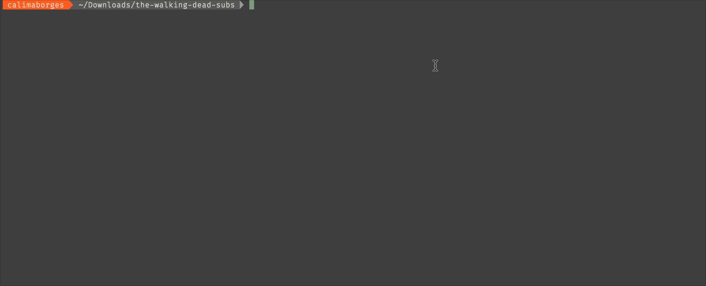

# legtv
[](https://travis-ci.org/calimaborges/legtv)

Unofficial Legendas TV CLI.



## Installation

* Go to https://github.com/calimaborges/legtv/releases/latest
* Download the CLI for your OS
* Download `unrar.node` and place it in the same folder
* Use like any other executable CLI

## Usage

```
legtv "the walking dead"
```

## Development run

```bash
yarn start "the walking dead"
rm *.srt                            # remove all subtitiles from dir since it downloads to current dir.
```

## Build

```bash
yarn build
```

An executable will be built inside `releases` folder. Run with `releases/legtv "the walking dead"`

## Test

```bash
LEGENDAS_TV_USERNAME=<username> LEGENDAS_TV_PASSWORD=<password> yarn test
```

## Release

```bash
npm version patch | minor | major && npm publish && git push && git push --tags && yarn release
```